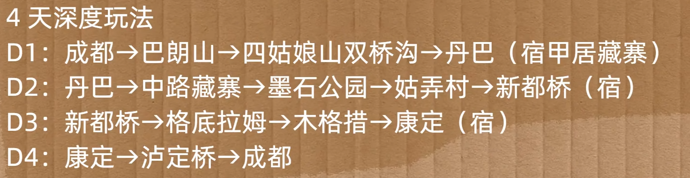
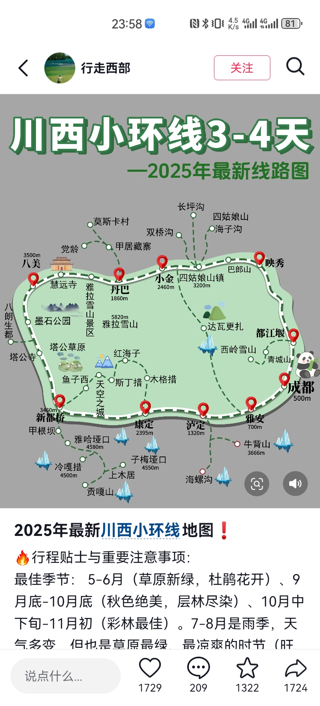

# 一、准备
- 氧气瓶*3， 葡萄糖
- 户外涉水鞋

# 二、攻略/行程

## 10月4日
- 总结：
    - 映秀镇/卧龙镇
    - 四姑娘山
    - 猫鼻梁观看雪山
    - 丹巴甲居藏寨，买第二天的备用口粮，检查油量是否过半

|时间|安排|费用|
|:--|:--|:--|
|9：00-11：00|起始取车点 路程:  终点:映秀镇（1小时路程）/卧龙镇(2小时路程)||
|11：00-12：00|午餐||
|12：00-14：00|起始：午餐点 终点：四姑娘山双桥沟||
|14：30-18：00|游览四姑娘山（双桥沟）|双成人：150 每人：75|
|18：00-18：30|起始：四姑娘山 终点：猫鼻梁服务区||
|18：30-19：00|猫鼻梁服务区观景||
|19:00-20:30|起始:猫鼻梁服务区  终点:丹巴（宿甲居藏寨）||
|20:30-|休息||

## 10月5日
- 总结
    - 亚拉雪山观景台
    - 墨石公园（选去）
    - 塔公草原
    - 姑弄村
    - 鱼子西，日照金山
    - 新都桥

|时间|安排|费用|
|:--|:--|:--|
|7：00-9：00|起始：丹巴甲居藏寨 路程：68km，1小时38分 终点：亚拉雪山观景台||
|9：00-10：00|观景游玩||
|10:00-11:30|起始：亚拉雪山观景台 路程：48km，57分钟 终点：塔公草原|35/人|
|11:30-14:00|观景游玩，休息午餐||
|14:00-14:40|起始：塔公草原 路程：8.8km，19分 终点：姑弄村||
|14：40-15：30|姑弄村赏景，休息||
|15：30-17：30|起始：姑弄村 路程：40km，1小时24分 终点:鱼子西||
|15：30-17：30|赏景||
|17：30-19：30|起始：鱼子西 路程：33km，1小时33分 终点：新都桥||

## 10月6日
- 总结：
    - 甲根坝
    - 格底拉姆·天空之城 （选去）
    - 红海子
    - 木格错（要注意下午的行程要留够时间给木格错）
    - 康定

|时间|安排|费用|
|:--|:--|:--|
|9：00-10：00|起始：新都桥 路程：26km，30分钟 终点：甲根坝||
|10：00-12：30|甲根坝游玩,午休||
|12：30-14：00|起始：甲根坝 路程：50km，59分 终点：格底拉姆||
|14：00-14：40|||
|14：40-16：20|起始：格底拉姆 路程：39km，1小时13分 终点：红海子||
|16：20-17：00|||
|17：00-18：00|起始：红海子 路程：36km，44分 终点：木格错||
|18：00-19：30|||
|19：30-21：30|起始：木格错 路程：37km，1小时32分 终点：康定||
|21：30-|||

## 10月7日
- 总结
    - 泸定
    - 全天服务区
    - 返程

|时间|安排|说明|
|:--|:--|:--|
|9：00-10：30|起始：康定 路程：37km，1小时32分 终点：泸定||
|10：30-13：30|泸定桥、午餐||
|13：30-15：00|起始：康定 路程：63km，51分 终点：天全服务区||
|15：00-15：30|打卡游览||
|15：30-18：00|起始：康定 路程：187km，1小时54分 终点：交大犀浦||
|23：00|还车||

# 三、活动费用
|活动|说明|价格|
|:-:|:-:|:-:|
|租车|神州租车 型号:探影|总计:1608 每人:804|
|油费|川西小环线1000km，|总计: 每人:|

